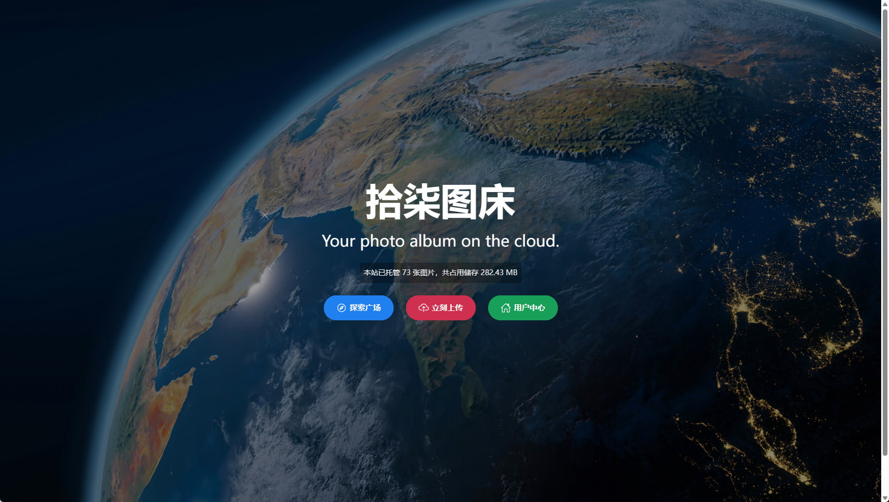
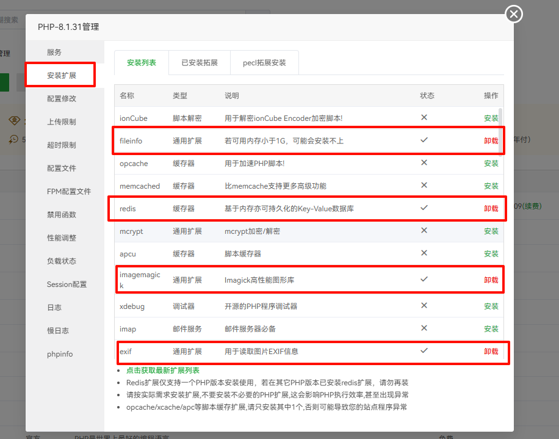
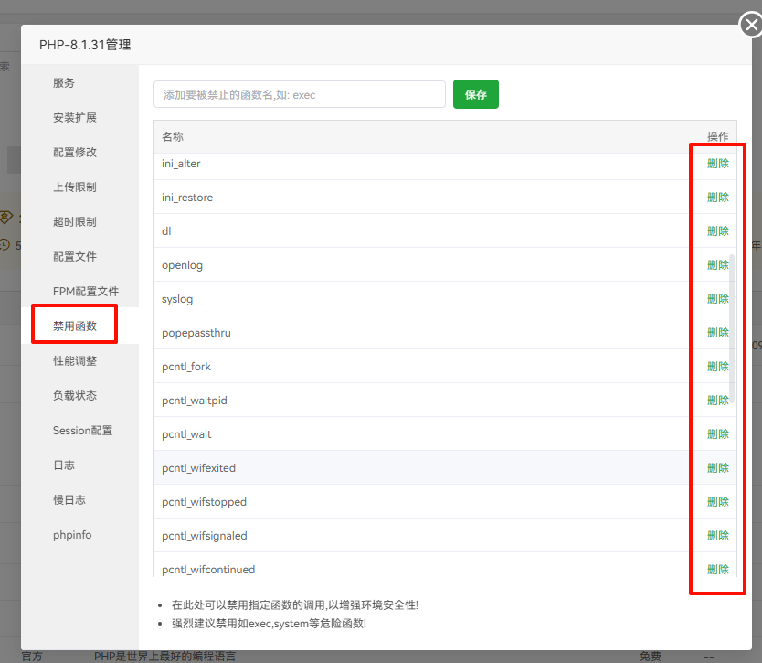
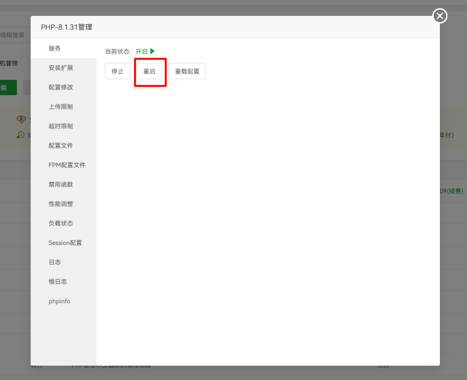
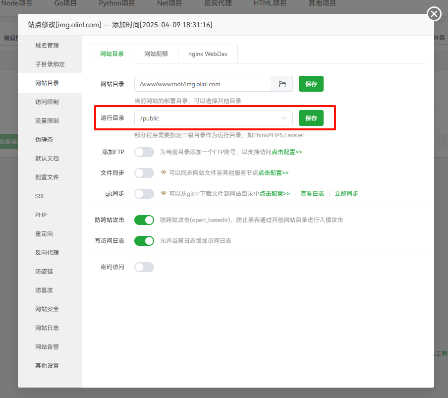
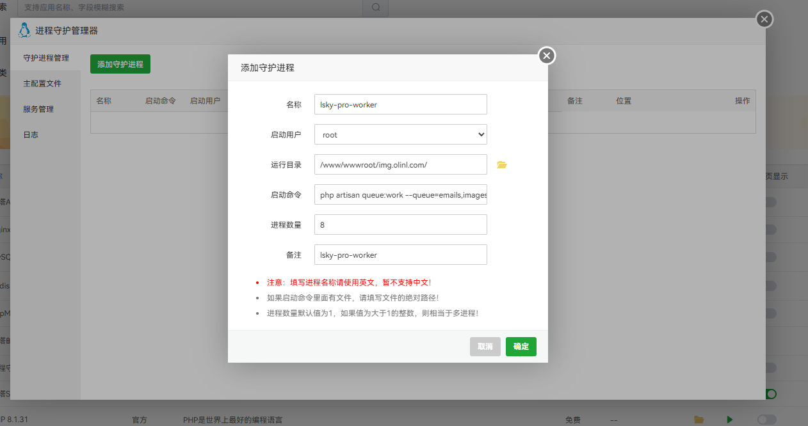
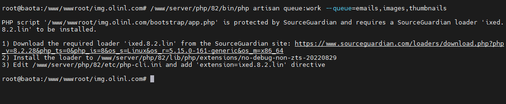
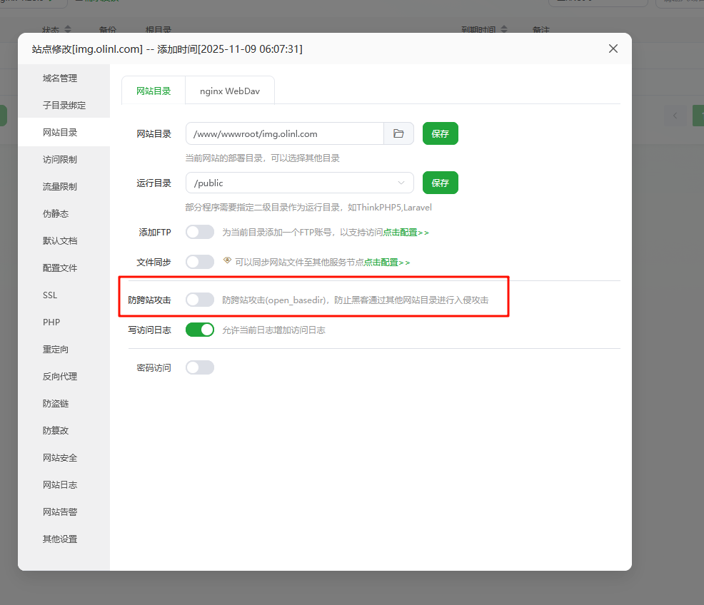
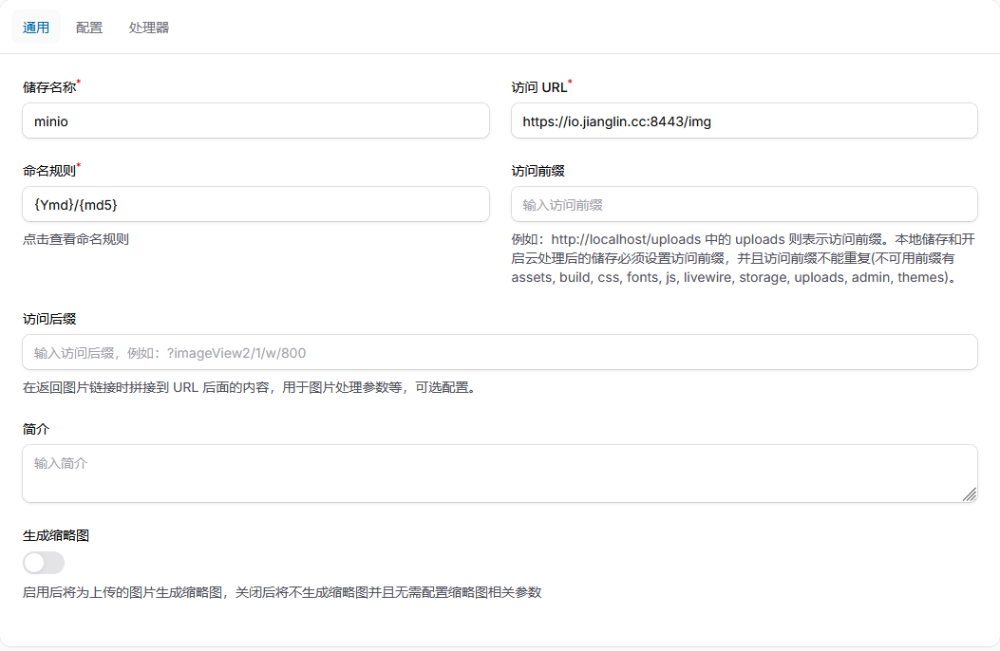
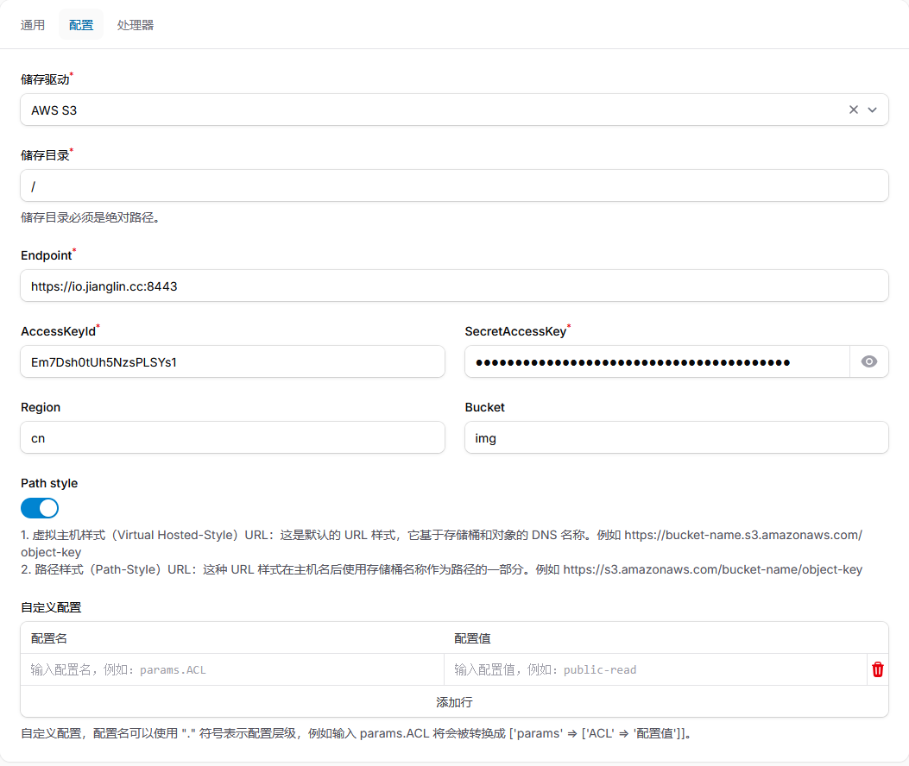

兰空图床是一个开源的图床，使用php编写，现目前主要是使用其强大的系统后台，结合本地的minio去搭建一个线上图库。这里使用的是Lsky Pro+(付费版本)。



兰空图床官网：[Lsky](https://www.lsky.pro/)

官方文档：[Lsky Pro+文档](https://docs.lsky.pro/)

---

## 1、安装环境

- Nginx 1.21+
- Mysql 5.7+
- PHP 8.2+
- Redis 7.0+
- Supervisor

需要在宝塔面板安装相应的组件，

## 2、配置php

### 1)、安装扩展
安装php的时候已经安装过一部分扩展，这里只需要补全所需的扩展即可

> 需要安装的扩展插件
>
> bcmath,ctype,dom,fileinfo,json,mbstring,openssl,pdo_mysql,pdo,tokenizer,xml,imagick,redis

宝塔面板 > PHP设置→安装扩展

- fileinfo
- imagemagick
- exif
- redis

安装以上插件



### 2)、禁用函数

PHP设置→禁用函数

- exec、shell_exec 函数
- readlink、symlink 函数
- putenv、getenv 函数
- proc_* 函数
- pcntl_* 函数
- pcntl_signal、pcntl_alarm、pcntl_exec 函数
- chown 函数




然后重启php服务



## 3、MySQL、Redis

添加一个**lsky**的数据库

## 4、添加站点

添加站点，域名需要和后台授权的域名一致

### 设置伪静态

```sql
location / {
  try_files $uri $uri/ /index.php?$query_string;
}
```

随后上传文件到网站根目录并解压

### 设置网站目录

运行目录设置为：/public



## 5、配置.env文件

找到网站根目录下的.env文件

根据如下进行配置

- APP_URL=站点域名(需要 http(s): //)
- APP_SERIAL_NO=购买后得到的序列号
- APP_SECRET=许可证的密钥
- DB_CONNECTION=(数据库驱动名称 mysql、sqlite、pgsql、sqlsrv)
- DB_HOST=数据库连接地址(默认为 127.0.0.1)
- DB_PORT=数据库连接端口(默认为 3306)
- DB_DATABASE=数据库名称
- DB_USERNAME=数据库连接账号
- DB_PASSWORD=数据库连接密码
- REDIS_HOST=Redis 连接地址(默认为 127.0.0.1)
- REDIS_PASSWORD=Redis 连接密码(默认为 null，表示没有密码)
- REDIS_PORT=Redis 连接端口(默认为 6379)

## 6、命令行配置(重要)

兰空图床企业版需要通过 php cli 的方式启动队列、计划任务处理进程，此操作需要登录 SSH。

#### 配置队列处理进程

打开 进程守护管理器进行配置

启动命令：

```yaml
php artisan queue:work --queue=emails,images,thumbnails

# 注：如果有多个php 需要指定哪个php
/www/server/php/82/bin/php artisan queue:work --queue=emails,images,thumbnails
```



如果出现以下问题



1. 点击这个链接下载：https://www.sourceguardian.com/loaders/download.php?php_v=8.2.28&php_ts=0&php_is=8&os_s=Linux&os_r=5.15.0-161-generic&os_m=x86_64

2. 将下载的 ixed.8.2.lin 文件上传到服务器目录：

```bash
/www/server/php/82/lib/php/extensions/no-debug-non-zts-20220829/

# 确保文件权限正确（一般 644 即可）
chmod 644 /www/server/php/82/lib/php/extensions/no-debug-non-zts-20220829/ixed.8.2.lin
```

3. 修改 php-cli.ini 启用扩展

```bash
nano /www/server/php/82/etc/php-cli.ini

# 在文件末尾添加一行：
extension=ixed.8.2.lin
```


#### 配置计划任务处理进程

计划任务需要用到 linux 中的 Crontab

```yaml
cd /www/wwwroot/img.olinl.com && php artisan schedule:run >> /dev/null 2>&1

# 注：如果有多个php 需要指定哪个php
cd /www/wwwroot/img.olinl.com && /www/server/php/82/bin/php artisan schedule:run >> /dev/null 2>&1
```


## 问题

### 问题1

如果出现这样的问题：Unsupported cipher or incorrect key length. Supported ciphers are: aes-128-cbc, aes-256-cbc, aes-128-gcm, aes-256-gcm. 

查看.env 的APP_KEY 的格式是否为base64:xxxxx

如果不是请在目录运行如下命令

```bash
/www/server/php/82/bin/php artisan key:generate
```

### 问题2

如果出现了这样的问题：file_exists(): open_basedir restriction in effect. File(/.dockerenv) is not within the allowed path(s): (/www/wwwroot/img.olinl.com/:/tmp/) 

关闭宝塔的防跨站攻击即可



## 配置AWS S3 （Minio存储）

访问 URL：<minio绑定的域名+/+存储桶名称>

存储目录：<存储桶里面的的文件夹，根目录填/即可>

Endpoint：<minio的域名>

Region：<默认填cn>

Bucket：<存储桶名称>

Path style：<勾选>



