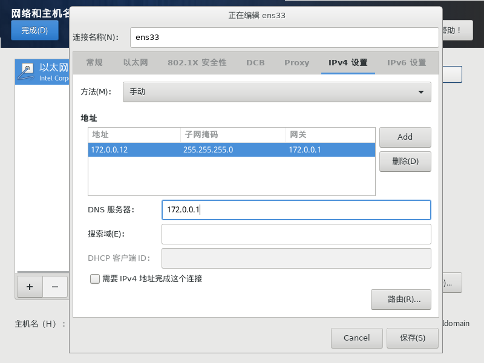
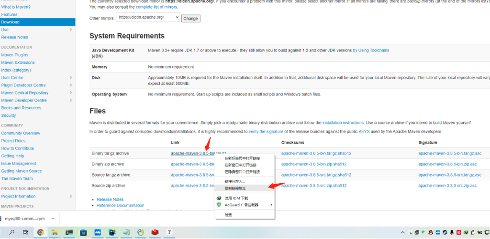
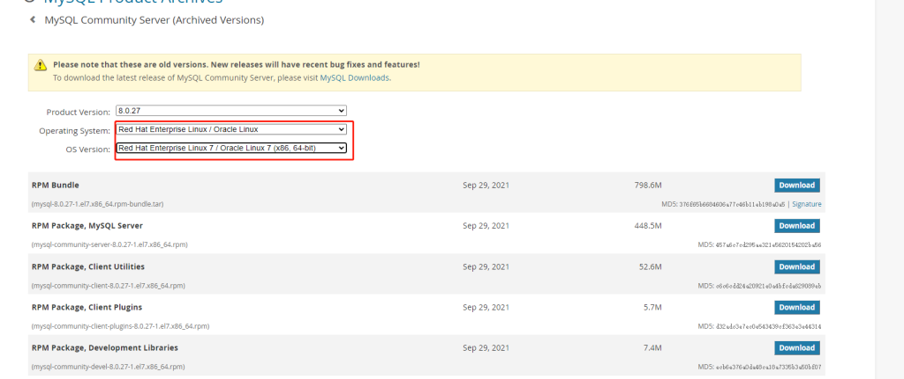
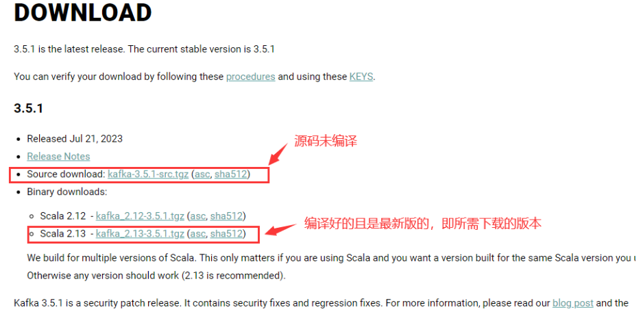

:::warning
此篇文章是之前各类杂乱的笔记文件整合而来，可能会出现其他未知问题，如有发现，请及时和站长联系。
:::


>**Centos停更说明：**
>CentOS操作系统已全面停止维护（EOL），继续使用会使系统暴露在新的安全漏洞之下，成为攻击目标，并可能违反相关安全合规要求。
>阿里云：[Centos操作系统](https://help.aliyun.com/zh/ecs/user-guide/options-for-dealing-with-centos-linux-end-of-life)

# 系统安装
Centos7镜像包：
```sql
https://cdn.olinl.com/centos/CentOS-7-x86_64-DVD-2009.iso
```

烧录镜像（二选一）
- 使用[Vertoy启动盘](https://www.ventoy.net/cn/index.html)
- 使用[Rufus](https://rufus.ie/zh/)
- 或者第三方镜像烧录工具

之后启动到U盘，进入安装流程，里面没什么可说的，都是可视化安装，下一步下一步即可。

之后启动到U盘，进入安装流程，里面没什么可说的，都是可视化安装，下一步下一步即可。

网络配置可以在安装界面配置，也可以使用dhcp 在安装完成后配置，但是开关一定要打开，不然无法使用SSH连接，如果在安装的时候没有网络，也可以关闭，然后后面手动开启网卡服务。



如果root密码设置过于简单，需要点击两次完成才可继续安装。

# 系统优化

在安装完成后，需要进行一些必要的优化

## 修改Ip地址

可以先ping一下外网是否可以访问

```bash

ping baidu.com


#网络正常
[root@harbor ~]# ping baidu.com
PING baidu.com (110.242.74.102) 56(84) bytes of data.
64 bytes from 110.242.74.102 (110.242.74.102): icmp_seq=1 ttl=51 time=20.2 ms
64 bytes from 110.242.74.102 (110.242.74.102): icmp_seq=2 ttl=51 time=20.0 ms
64 bytes from 110.242.74.102 (110.242.74.102): icmp_seq=3 ttl=51 time=26.6 ms
64 bytes from 110.242.74.102 (110.242.74.102): icmp_seq=4 ttl=51 time=20.0 ms
64 bytes from 110.242.74.102 (110.242.74.102): icmp_seq=5 ttl=51 time=20.0 ms
^C
--- baidu.com ping statistics ---
5 packets transmitted, 5 received, 0% packet loss, time 4004ms
rtt min/avg/max/mdev = 20.061/21.424/26.605/2.595 ms

```

如果没有打印延迟等信息，就说明网络是断开的。

## 查看网卡名称

```bash

#查看网卡，通常是ens开头的
ip addr

# 查看网卡名称为ens33
[root@172-0-0-12 ~]# ip addr
1: lo: <LOOPBACK,UP,LOWER_UP> mtu 65536 qdisc noqueue state UNKNOWN group default qlen 1000
    link/loopback 00:00:00:00:00:00 brd 00:00:00:00:00:00
    inet 127.0.0.1/8 scope host lo
       valid_lft forever preferred_lft forever
    inet6 ::1/128 scope host
       valid_lft forever preferred_lft forever
2: ens33: <BROADCAST,MULTICAST,UP,LOWER_UP> mtu 1500 qdisc pfifo_fast state UP group default qlen 1000
    link/ether 00:0c:29:06:59:5c brd ff:ff:ff:ff:ff:ff
    inet 172.0.0.12/24 brd 172.0.0.255 scope global noprefixroute ens33
       valid_lft forever preferred_lft forever
    inet6 fe80::e1ff:d529:c8cb:6d1a/64 scope link noprefixroute
       valid_lft forever preferred_lft forever
       
```

## 修改网卡配置

```bash

# 修改网卡配置
# vi /etc/sysconfig/network-scripts/ifcfg-<网卡名称>
vi /etc/sysconfig/network-scripts/ifcfg-ens33

```

修改关键字段：

```bash

BOOTPROTO=static
ONBOOT=yes
IPADDR=192.168.1.100
NETMASK=255.255.255.0
GATEWAY=192.168.1.1
DNS1=8.8.8.8

```

> BOOTPROTO=static - 静态ip
> ONBOOT=yes - 启动时自动激活
> IPADDR=192.168.1.100 - ip地址
> NETMASK=255.255.255.0 - 掩码，通常为255.255.255.0
> GATEWAY=192.168.1.1 - 网关
> DNS1=8.8.8.8 - DNS地址

修改完成后保存，重启network服务

```bash

service network restart

# 对于使用旧版network服务的系统
/etc/init.d/network restart
/etc/init.d/network stop && /etc/init.d/network start

```

然后就可以正常联网了。

## 更换yum源

> 由于centos7已经停止服务，部分源已经无法访问，如果显示404等问题，请自行寻找可用源


```bash

# 备份yum源
mv /etc/yum.repos.d/CentOS-Base.repo /etc/yum.repos.d/CentOS-Base.repo.backup

# 下载国内yum源配置文件
## 如果无法使用可以手动创建文件然后复制进去
vi /etc/yum.repos.d/CentOS-Base.repo
## 阿里源（推荐）：
wget -O /etc/yum.repos.d/CentOS-Base.repo http://mirrors.aliyun.com/repo/Centos-7.repo
### 当wget无法使用时
#curl -o /etc/yum.repos.d/CentOS-Base.repo http://mirrors.aliyun.com/repo/Centos-7.repo
## 网易源：
wget -O /etc/yum.repos.d/CentOS-Base.repo http://mirrors.163.com/.help/CentOS7-Base-163.repo
### 当wget无法使用时
#curl -o /etc/yum.repos.d/CentOS-Base.repo http://mirrors.163.com/.help/CentOS7-Base-163.repo

# 清理yum缓存，并生成新的缓存
yum clean all
yum makecache

# 更新yum源
yum update -y

```

## 安装必要的软件包

```bash

yum -y install  epel-release
yum -y install wget vim net-tools telnet lsof tree htop zip unzip iperf3

```

:::note
- wget：用于下载文件和网页
- vim：用于编辑文本文件
- net-tools：用于管理网络配置
- telnet：用于测试网络连接
- lsof：用于查看系统打开的文件
- tree：用于查看目录结构
- htop：用于更好的查看进程
- zip、unzip：用于解压缩zip文件
- iperf3：内网测速工具

:::

## 硬盘操作

此操作可以借助lvm2工具，详细操作见另一篇文章

（此处留存，如果没加文章就是lvm2工具使用文章没肝出来）

## 配置SELinux

SELinux是CentOS7的安全模块，它可以提高系统的安全性。但是，如果不正确配置，它可能会导致一些问题。以下是一些常见的SELinux配置

```bash

# 临时禁用SELinux
setenforce 0

# 永久禁用SELinux
vi /etc/selinux/config
## 修改为下面内容
SELINUX=disabled

```

## 防火墙操作

一般情况下可以直接把防火墙关闭即可

```bash

# 停止防火墙服务
systemctl stop firewalld.service
# 停止开机自启
systemctl disable firewalld.service

```

如果有较真的，请往下看

**添加一个端口**

```bash

# 添加端口
## --permanent永久生效，没有此参数重启后失效
firewall-cmd --zone=public --add-port=5005/tcp --permanent

# 添加端口外部访问权限（这样外部才能访问）
firewall-cmd --add-port=5005/tcp

# 更新防火墙规则
firewall-cmd --reload

```

## 查看端口是否开放

```bash
firewall-cmd --zone=public --query-port=80/tcp
```

**删除端口**

```bash
firewall-cmd --zone=public --remove-port=80/tcp --permanent
```

**查看firewall是否运行**

```bash
# 两个命令都可以
systemctl status firewalld

firewall-cmd --state
```

**查看开启了哪些服务**
```bash
firewall-cmd --list-services
```

**查看所有打开的端口**

```bash
firewall-cmd --zone=public --list-ports
```

## 一键运行脚本

**包含更新阿里yum源，安装软件包，关闭防火墙**

```bash
yum install wget -y
mv /etc/yum.repos.d/CentOS-Base.repo /etc/yum.repos.d/CentOS-Base.repo.backup
curl -o /etc/yum.repos.d/CentOS-Base.repo http://mirrors.aliyun.com/repo/Centos-7.repo
yum clean all
yum makecache
yum update -y
yum -y install  epel-release
yum -y install wget vim net-tools telnet lsof tree htop zip unzip iperf3
systemctl stop firewalld.service
systemctl disable firewalld.service
```


# 系统优化（可选操作）

## 修改主机名

```bash
# 查看主机名
hostname
# 修改主机名
hostnamectl set-hostname 主机名
```


## 配置免密登录
```bash
# 在A客户端上生成公钥和私钥
ssh-keygen -t rsa


# ====================================================
# 拷贝及配置方案
ssh-copy-id -i ~/.ssh/id_rsa.pub 'root@要拷贝到的机器ip'
```

## 配置host

服务器多的时候可以配置hosts，直接通过关键字访问，避免使用ip访问，以免更换ip时还要修改配置

```bash

vim /etc/hosts

# 添加配置格式
#ip地址 别名
192.168.0.100 vm100

```

## 使用scp传输文件

**从服务器上下载文件**

例如：把 192.168.0.101 上的 /data/test.txt 的文件下载到 /home（本地目录）

```bash
#scp 用户名@服务器地址:要下载的文件路径 保存文件的文件夹路径
scp root@192.168.0.101:/data/test.txt /home
```

**上传本地文件到服务器**

例如：把本机 /home/test.txt 文件上传到 192.168.0.101 这台服务器上的 /data/ 目录中

```bash
#scp 要上传的文件路径 用户名@服务器地址:服务器保存路径
scp /home/test.txt root@192.168.0.101:/data/
```
**从服务器下载整个目录**
例如：把 192.168.0.101 上的 /data 目录下载到 /home（本地目录）

```bash
#scp -r 用户名@服务器地址:要下载的服务器目录 保存下载的目录
scp -r root@192.168.0.101:/data  /home/
```

**上传目录到服务器**

例如：把 /home 目录上传到服务器的 /data/ 目录

```bash
#scp -r 要上传的目录 用户名@服务器地址:服务器的保存目录
scp -r /home root@192.168.0.101:/data/
```

## 安装rpm包

```bash
# 批量安装rpm
rpm -ivh *.rpm

# 查询并过滤已安装的软件包
## -qa 参数表示查询所有（-q）已安装的软件包（-a）grep表示过滤
rpm -qa | grep firefox

# 卸载
rpm -e firefox

# 带参数安装
rpm -ivh *.rpm --nodeps --force
```

## 赋权

```bash
# 赋予读写权限
chmod -R 777 文件或目录
# chmod -R 777 /usr/local/mysql/*

# 赋予可执行权限
chmod +x 文件
```

## 查看端口占用

```bash
yum -y install lsof

lsof -i tcp:80

# 关掉占用的服务
kill pid
kill -9 pid
```

# 软件安装

## 代理服务器Squid

在实际操作的时候，可能遇到服务器没有网络，那么我们就需要在边缘服务器安装一个代理工具

找一台可以接入局域网的服务器，安装squid组件，作为一个代理服务器使用

### 安装

**在有互联网的服务器上面进行安装**

```bash
# 安装squid
yum install -y squid

# 启动服务
systemctl start squid
systemctl enable squid

# 配置文件
vim /etc/squid/squid.conf

# 允许所有访问
## 注释掉所有的http_access
http_access allow all

# 重启服务
systemctl restart squid
```

### 使用方式

**在无互联网的服务器上如何使用**

```bash
# 配置http、https代理
## 仅在当前命令行中有效
## 请勿使用sudo命令，sudo yum install 无法通过代理安装软件
export http_proxy=http://代理服务器ip:3128
export https_proxy=http://代理服务器ip:3128

# 例如
export http_proxy=http://192.168.0.217:3128
export https_proxy=http://192.168.0.217:3128


# 查看代理配置
echo $http_proxy
echo $https_proxy
```

## 安装jdk环境

请确认是否安装wget、vim，如果没有安装请允许下面命令安装

```bash
# 安装wget vim
yum install wget vim -y
```

一般情况下，我们不会通过软件包进行安装，而是直接配置环境变量使用

### 下载解压

```bash
# 下载jdk1.8
wget https://cdn.olinl.com/centos/jdk-8u201-linux-x64.tar.gz
## 原地址
# https://repo.huaweicloud.com/java/jdk/8u201-b09/jdk-8u201-linux-x64.tar.gz

#确定安装目录为/opt
# 解压文件夹并移动到opt
tar -zxvf jdk-8u201-linux-x64.tar.gz
mv jdk1.8.0_201 /opt/jdk1.8/

```

### 配置环境

```bash
# 环境配置文件
vim /etc/profile

# 到最下面插入以下内容
# Java1.8
export JAVA_HOME=/opt/jdk1.8
export PATH=$JAVA_HOME/bin:$PATH
export CLASSPATH=.:$JAVA_HOME/lib/dt.jar:$JAVA_HOME/lib/tools.jar

# 刷新配置
source /etc/profile

# 验证java版本信息，显示版本号即生效
java -version
```


## 安装maven环境

一般情况下，我们会使用下载文件后配置环境变量的方法进行安装

### 下载解压

这里的版本是 apache-maven-3.8.1-bin.tar.gz

官网下载：https://maven.apache.org/download.cgi

以前版本下载地址：https://archive.apache.org/dist/maven/maven-3



```bash
# 下载包
## 如果提示证书过期，在最后面添加  --no-check-certificate
wget https://archive.apache.org/dist/maven/maven-3/3.8.5/binaries/apache-maven-3.8.5-bin.tar.gz

# 3.8.5备份
wget https://cdn.olinl.com/centos/apache-maven-3.8.5-bin.tar.gz
# 3.9.9备份
wget https://cdn.olinl.com/centos/apache-maven-3.9.9-bin.tar.gz

# 解压并移动到opt文件夹
tar -zxvf apache-maven-3.8.5-bin.tar.gz
mv apache-maven-3.8.5 /opt/maven-3.8.5/
```

### 配置环境

```bash
# 系统环境变量配置
vim /etc/profile

# 在末尾追加
# maven-3.8.5
export MAVEN_HOME=/opt/maven-3.8.5
export PATH=.:$PATH:$MAVEN_HOME/bin

# 刷新配置
source /etc/profile

# 验证生效，显示版本号即生效
mvn -version
```

### maven setting.xml配置

- localRepository 为本地仓库地址
- server可配置密码密钥等信息
- mirror配置镜像仓库信息

配置示例

```xml
<?xml version="1.0" encoding="UTF-8"?>

<!--
Licensed to the Apache Software Foundation (ASF) under one
or more contributor license agreements.  See the NOTICE file
distributed with this work for additional information
regarding copyright ownership.  The ASF licenses this file
to you under the Apache License, Version 2.0 (the
"License"); you may not use this file except in compliance
with the License.  You may obtain a copy of the License at

    http://www.apache.org/licenses/LICENSE-2.0

Unless required by applicable law or agreed to in writing,
software distributed under the License is distributed on an
"AS IS" BASIS, WITHOUT WARRANTIES OR CONDITIONS OF ANY
KIND, either express or implied.  See the License for the
specific language governing permissions and limitations
under the License.
-->

<!--
 | This is the configuration file for Maven. It can be specified at two levels:
 |
 |  1. User Level. This settings.xml file provides configuration for a single user,
 |                 and is normally provided in ${user.home}/.m2/settings.xml.
 |
 |                 NOTE: This location can be overridden with the CLI option:
 |
 |                 -s /path/to/user/settings.xml
 |
 |  2. Global Level. This settings.xml file provides configuration for all Maven
 |                 users on a machine (assuming they're all using the same Maven
 |                 installation). It's normally provided in
 |                 ${maven.conf}/settings.xml.
 |
 |                 NOTE: This location can be overridden with the CLI option:
 |
 |                 -gs /path/to/global/settings.xml
 |
 | The sections in this sample file are intended to give you a running start at
 | getting the most out of your Maven installation. Where appropriate, the default
 | values (values used when the setting is not specified) are provided.
 |
 |-->
<settings xmlns="http://maven.apache.org/SETTINGS/1.2.0"
          xmlns:xsi="http://www.w3.org/2001/XMLSchema-instance"
          xsi:schemaLocation="http://maven.apache.org/SETTINGS/1.2.0 https://maven.apache.org/xsd/settings-1.2.0.xsd">
  <!-- localRepository
   | The path to the local repository maven will use to store artifacts.
   |
   | Default: ${user.home}/.m2/repository
  <localRepository>/path/to/local/repo</localRepository>
  -->
  <localRepository>\opt\maven\repository</localRepository>
  <!-- interactiveMode
   | This will determine whether maven prompts you when it needs input. If set to false,
   | maven will use a sensible default value, perhaps based on some other setting, for
   | the parameter in question.
   |
   | Default: true
  <interactiveMode>true</interactiveMode>
  -->

  <!-- offline
   | Determines whether maven should attempt to connect to the network when executing a build.
   | This will have an effect on artifact downloads, artifact deployment, and others.
   |
   | Default: false
  <offline>false</offline>
  -->

  <!-- pluginGroups
   | This is a list of additional group identifiers that will be searched when resolving plugins by their prefix, i.e.
   | when invoking a command line like "mvn prefix:goal". Maven will automatically add the group identifiers
   | "org.apache.maven.plugins" and "org.codehaus.mojo" if these are not already contained in the list.
   |-->
  <pluginGroups>
    <!-- pluginGroup
     | Specifies a further group identifier to use for plugin lookup.
    <pluginGroup>com.your.plugins</pluginGroup>
    -->
  </pluginGroups>

  <!-- TODO Since when can proxies be selected as depicted? -->
  <!-- proxies
   | This is a list of proxies which can be used on this machine to connect to the network.
   | Unless otherwise specified (by system property or command-line switch), the first proxy
   | specification in this list marked as active will be used.
   |-->
  <proxies>
    <!-- proxy
     | Specification for one proxy, to be used in connecting to the network.
     |
    <proxy>
      <id>optional</id>
      <active>true</active>
      <protocol>http</protocol>
      <username>proxyuser</username>
      <password>proxypass</password>
      <host>proxy.host.net</host>
      <port>80</port>
      <nonProxyHosts>local.net|some.host.com</nonProxyHosts>
    </proxy>
    -->
  </proxies>

  <!-- servers
   | This is a list of authentication profiles, keyed by the server-id used within the system.
   | Authentication profiles can be used whenever maven must make a connection to a remote server.
   |-->
  <servers>
  <server>
    <id>bladex</id>
    <configuration>
      <httpHeaders>
        <property>
          <name>Authorization</name>
          <value>token验证信息</value>
        </property>
      </httpHeaders>
    </configuration>
  </server>
   <server>
      <!--远程仓库的名称-->
      <id>nexus-maven</id>
      <!--访问 Nexus 的账号-->
      <username>admin</username>
      <!--访问 Nexus 的密码-->
      <password>admin123</password>
    </server>
    <!-- server
     | Specifies the authentication information to use when connecting to a particular server, identified by
     | a unique name within the system (referred to by the 'id' attribute below).
     |
     | NOTE: You should either specify username/password OR privateKey/passphrase, since these pairings are
     |       used together.
     |
    <server>
      <id>deploymentRepo</id>
      <username>repouser</username>
      <password>repopwd</password>
    </server>
    -->

    <!-- Another sample, using keys to authenticate.
    <server>
      <id>siteServer</id>
      <privateKey>/path/to/private/key</privateKey>
      <passphrase>optional; leave empty if not used.</passphrase>
    </server>
    -->
  </servers>

  <!-- mirrors
   | This is a list of mirrors to be used in downloading artifacts from remote repositories.
   |
   | It works like this: a POM may declare a repository to use in resolving certain artifacts.
   | However, this repository may have problems with heavy traffic at times, so people have mirrored
   | it to several places.
   |
   | That repository definition will have a unique id, so we can create a mirror reference for that
   | repository, to be used as an alternate download site. The mirror site will be the preferred
   | server for that repository.
   |-->
  <mirrors>
    <!-- mirror
     | Specifies a repository mirror site to use instead of a given repository. The repository that
     | this mirror serves has an ID that matches the mirrorOf element of this mirror. IDs are used
     | for inheritance and direct lookup purposes, and must be unique across the set of mirrors.
     |
    <mirror>
      <id>mirrorId</id>
      <mirrorOf>repositoryId</mirrorOf>
      <name>Human Readable Name for this Mirror.</name>
      <url>http://my.repository.com/repo/path</url>
    </mirror>
     -->
   <mirror>
        <!--远程仓库的名称-->
        <id>nexus-maven</id>
        <!--镜像名称，可以随便取名-->
        <name>Nexus私服</name>
        <!--远程仓库的地址-->
        <url>http://192.168.2.10:3001/repository/nexus-group/</url>
        <!--此处配置为星号（*），表示 maven 下载所有 jar 包，都必须从 Nexus 上面配置的远程仓库地址中获取-->
        <mirrorOf>*,!bladex</mirrorOf>
    </mirror>

    <mirror>
        <id>aliyun-repos</id>
        <name>Aliyun Public Repository</name>
        <url>https://maven.aliyun.com/repository/public</url>        
        <mirrorOf>*,!bladex</mirrorOf>
    </mirror>
   
  
   
</mirrors>

  <!-- profiles
   | This is a list of profiles which can be activated in a variety of ways, and which can modify
   | the build process. Profiles provided in the settings.xml are intended to provide local machine-
   | specific paths and repository locations which allow the build to work in the local environment.
   |
   | For example, if you have an integration testing plugin - like cactus - that needs to know where
   | your Tomcat instance is installed, you can provide a variable here such that the variable is
   | dereferenced during the build process to configure the cactus plugin.
   |
   | As noted above, profiles can be activated in a variety of ways. One way - the activeProfiles
   | section of this document (settings.xml) - will be discussed later. Another way essentially
   | relies on the detection of a property, either matching a particular value for the property,
   | or merely testing its existence. Profiles can also be activated by JDK version prefix, where a
   | value of '1.4' might activate a profile when the build is executed on a JDK version of '1.4.2_07'.
   | Finally, the list of active profiles can be specified directly from the command line.
   |
   | NOTE: For profiles defined in the settings.xml, you are restricted to specifying only artifact
   |       repositories, plugin repositories, and free-form properties to be used as configuration
   |       variables for plugins in the POM.
   |
   |-->
  <profiles>
    <!-- profile
     | Specifies a set of introductions to the build process, to be activated using one or more of the
     | mechanisms described above. For inheritance purposes, and to activate profiles via <activatedProfiles/>
     | or the command line, profiles have to have an ID that is unique.
     |
     | An encouraged best practice for profile identification is to use a consistent naming convention
     | for profiles, such as 'env-dev', 'env-test', 'env-production', 'user-jdcasey', 'user-brett', etc.
     | This will make it more intuitive to understand what the set of introduced profiles is attempting
     | to accomplish, particularly when you only have a list of profile id's for debug.
     |
     | This profile example uses the JDK version to trigger activation, and provides a JDK-specific repo.
    <profile>
      <id>jdk-1.4</id>

      <activation>
        <jdk>1.4</jdk>
      </activation>

      <repositories>
        <repository>
          <id>jdk14</id>
          <name>Repository for JDK 1.4 builds</name>
          <url>http://www.myhost.com/maven/jdk14</url>
          <layout>default</layout>
          <snapshotPolicy>always</snapshotPolicy>
        </repository>
      </repositories>
    </profile>
    -->

    <!--
     | Here is another profile, activated by the property 'target-env' with a value of 'dev', which
     | provides a specific path to the Tomcat instance. To use this, your plugin configuration might
     | hypothetically look like:
     |
     | ...
     | <plugin>
     |   <groupId>org.myco.myplugins</groupId>
     |   <artifactId>myplugin</artifactId>
     |
     |   <configuration>
     |     <tomcatLocation>${tomcatPath}</tomcatLocation>
     |   </configuration>
     | </plugin>
     | ...
     |
     | NOTE: If you just wanted to inject this configuration whenever someone set 'target-env' to
     |       anything, you could just leave off the <value/> inside the activation-property.
     |
    <profile>
      <id>env-dev</id>

      <activation>
        <property>
          <name>target-env</name>
          <value>dev</value>
        </property>
      </activation>

      <properties>
        <tomcatPath>/path/to/tomcat/instance</tomcatPath>
      </properties>
    </profile>
    -->
  </profiles>

  <!-- activeProfiles
   | List of profiles that are active for all builds.
   |
  <activeProfiles>
    <activeProfile>alwaysActiveProfile</activeProfile>
    <activeProfile>anotherAlwaysActiveProfile</activeProfile>
  </activeProfiles>
  -->
</settings>
```

## 安装MySQL 5.7

采用官网rpm包安装，版本为5.7的最后一个版本

### 下载解压

获取下载链接，可以使用本站cdn地址

```sql
# 全量包
https://cdn.olinl.com/centos/mysql-5.7.43-1.el7.x86_64.rpm-bundle.tar

# 只包含必须安装的包
https://cdn.olinl.com/centos/mysql-5.7.43-1.el7.x86_64.rpm-bundle-lite.tar
```

打开mysql 社区版下载网站：https://downloads.mysql.com/archives/community

CentOS 是基于红帽的，Select OS Version: 选择 linux 7，如下图



复制地址：

```sql
# 官网mysql 5.7 地址
https://downloads.mysql.com/archives/get/p/23/file/mysql-5.7.44-1.el7.x86_64.rpm-bundle.tar
```

下载并解压

```bash
# 下载包 
wget https://cdn.olinl.com/centos/mysql-5.7.44-1.el7.x86_64.rpm-bundle-lite.tar # 精简包
# wget https://downloads.mysql.com/archives/get/p/23/file/mysql-5.7.44-1.el7.x86_64.rpm-bundle.tar # 官网
# wget https://cdn.olinl.com/centos/mysql-5.7.44-1.el7.x86_64.rpm-bundle.tar # 全量cdn

# 解压压缩包
tar -xvf mysql-8.0.27-1.el7.x86_64.rpm*.tar
```

### 安装并配置

```bash
# 安装必要软件包
rpm -ivh mysql-community-common-5.7*.x86_64.rpm --nodeps --force
rpm -ivh mysql-community-libs-5.7*.x86_64.rpm --nodeps --force
rpm -ivh mysql-community-client-5.7*.x86_64.rpm --nodeps --force
rpm -ivh mysql-community-server-5.7*.x86_64.rpm --nodeps --force

# 查看已安装的mysql
rpm -qa | grep mysql
```

**初始化mysql，并开启服务**(常规做法)

这里是使用默认目录，默认的配置，自定义目录请看下面

```bash
# 初始化mysql
mysqld --initialize;
# 给数据目录权限
chown mysql:mysql /var/lib/mysql -R;
# 启动服务
systemctl start mysqld.service;
# 设置自启动
systemctl enable mysqld;

# 查看密码
cat /var/log/mysqld.log | grep password

# 登录并修改密码
mysql -uroot -p
## 输入上面获取的密码
## 修改密码并刷新配置
ALTER USER 'root'@'localhost' IDENTIFIED WITH mysql_native_password BY 'root';
flush privileges;
```

**初始化mysql，使用自定义数据目录，并配置文件**

这里使用自定义数据目录，`/opt/mysql/data`

注意：设置自定义目录要禁用SELinux

```bash
# 创建数据目录
mkdir -p /opt/mysql/data
# 修改my.cnf文件

# 修改数据目录
datadir=/opt/mysql/data
# 修改日志目录
log-error=/opt/mysql/mysqld.log
# 修改socket
socket=/opt/mysql/mysql.sock

# 给数据目录赋权
chmod -R 777 /opt/mysql/*
chmod -R 777 /opt/mysql/data/*
chown mysql:mysql /opt/mysql -R;
chown mysql:mysql /opt/mysql/data -R;
chown mysql:mysql /var/lib/mysql -R;


# 使用mysql用户初始化
sudo -u mysql mysqld --initialize --datadir=/opt/mysql/data
# 启动服务
systemctl start mysqld.service;
# 设置自启动
systemctl enable mysqld;

# 查看密码 下面的log需要替换成新的log文件
cat /opt/mysql/mysqld.log | grep password

# 登录并修改密码
mysql -uroot -p
## 输入上面获取的密码
## 修改密码并刷新配置
ALTER USER 'root'@'localhost' IDENTIFIED WITH mysql_native_password BY 'root';
flush privileges;
```

**设置外部访问**

mysql安装成功后，root的只能localhost登录，需要修改为% 所有域都可访问

**修改root用户(不推荐)**

```bash
# 登录
mysql -uroot -p

# 修改用户表
update user set host = '%' where user ='root';
# 刷新配置
flush privileges;
```

**创建一个允许外部访问的用户**

```sql
# 登录
mysql -uroot -p

# 修改用户表
CREATE USER 'root'@'%' IDENTIFIED BY 'root';
GRANT ALL PRIVILEGES ON *.* TO 'root'@'%' WITH GRANT OPTION;
# 刷新配置
flush privileges;
```

## 安装redis

redis版本：6.2.6

通过yum或者rpm包安装，下载文件本地编译，然后配置system文件，使用systemctl进行管理

### 下载解压

```bash
# 下载redis
wget https://cdn.olinl.com/redis-6.2.6.tar.gz
## 原地址
#wget https://download.redis.io/releases/redis-6.2.6.tar.gz

# 解压并移动到opt下
tar xzf redis-6.2.6.tar.gz
mv redis-6.2.6 /opt/redis
```

### 编译安装

```bash
# 安装编译所需工具
yum -y install gcc automake autoconf libtool make

# 进入redis安装目录，进行编译
cd /opt/redis
make MALLOC=libc

# 安装redis，并指定安装目录
make install PREFIX=/opt/redis

# 启动测试
./bin/redis-server redis.conf
```

### 配置服务

**设置redis密码**

```bash
# 修改redis.conf配置
vim /opt/redis/redis.conf

:901行
requirepass root
```

**外部访问redis**

```bash
# 修改redis.conf配置
vim /opt/redis/redis.conf

:75行
bind 0.0.0.0 ::1
```

**设置redis后台运行**

```bash
# 修改redis.conf配置
vim /opt/redis/redis.conf

:257行
daemonize yes
```

**设置redis服务**

```bash
# 创建系统服务文件
vim /etc/systemd/system/redis.service

# 内容如下
[Unit]
Description=redis-server
After=network.target

[Service]
Type=forking
ExecStart=/opt/redis/bin/redis-server /opt/redis/redis.conf
PrivateTmp=true

[Install]
WantedBy=multi-user.target

# 重载系统服务
systemctl daemon-reload

# 服务启动操作命令
## 启动
systemctl start redis
## 停止
systemctl stop redis
## 重启
systemctl restart redis
## 查看状态
systemctl status redis
## 开机自启
systemctl enable redis
## 查看redis是否启动
ps -ef | grep redis
```

## 安装 Nginx

使用yum安装nginx

### 安装

配置nginx源

```bash
# 执行如下命令
rpm -ivh http://nginx.org/packages/centos/7/noarch/RPMS/nginx-release-centos-7-0.el7.ngx.noarch.rpm

# 执行以下命令开始安装

yum install -y nginx

# 启动nginx
systemctl start nginx
# nginx开机自启动
systemctl enable nginx
```

### 生产配置

通常我们不会直接修改nginx主配置文件，会采用引入的方式去配置

可以一个端口配置多个站点，nginx允许这样操作


```sql
# a站点
server {
    listen 80;
    server_name  a.com;
}
# b站点
server {
    listen 80;
    server_name  b.com;
}
# c站点
server {
    listen 80;
    server_name  c.com;
}
```

**nginx主配置文件常用配置**

```sql
# 处理HTTP请求和响应，适用于Web应用和网站
http{
  # 其他内容......

  #这里可以吧默认的include /etc/nginx/conf.d/*.conf;注释掉，方式展示80端口

  # 引入外部配置文件
  include /opt/nginx/http/*.conf;

  #不限制文件上传大小
  client_max_body_size 0;
}

# 支持通用TCP和UDP代理，适用于多种应用
stream{
  # 引入外部配置
  include /aoptp/nginx/server/*.conf;
}
```


**常规vue反向代理配置**

```bash
server {
    listen       7000;
    server_name  localhost;
    index index.html;
    
     set $root "/app/h5";

    location / {
        root   $root;  # 网站根目录
        index  index.html;   # 默认首页文件
        try_files  $uri $uri/ /index.html;
        add_header Access-Control-Allow-Origin *;
        add_header 'Access-Control-Allow-Credentials' 'true';
        add_header 'Access-Control-Allow-Methods' *;
        add_header 'Access-Control-Allow-Headers' *;
        add_header Cache-Control no-cache;
    }

    location ^~ /api {
        if ($request_method = 'OPTIONS') {
            add_header 'Access-Control-Allow-Origin' '*';
            add_header 'Access-Control-Allow-Methods' 'GET, POST, OPTIONS';
            add_header 'Access-Control-Allow-Headers' 'DNT,User-Agent,X-Requested-With,If-Modified-Since,Cache-Control,Content-Type,Range';
            add_header 'Content-Length' 0;
            add_header 'Content-Type' 'text/plain; charset=utf-8';
            return 204;
        }

        add_header 'Access-Control-Allow-Origin' '*' always;
        add_header 'Access-Control-Allow-Methods' 'GET, POST' always;
        add_header 'Access-Control-Allow-Headers' 'DNT,User-Agent,X-Requested-With,If-Modified-Since,Cache-Control,Content-Type,Range' always;
        add_header 'Access-Control-Expose-Headers' 'Content-Length,Content-Range' always;

        # 重写：/api/xxx → /xxx
        rewrite ^/api/(.*)$ /$1 break;

        proxy_pass http://192.168.1.20:31100;
        proxy_set_header Host $host;
        proxy_set_header X-Real-IP $remote_addr;
        proxy_set_header X-Forwarded-For $proxy_add_x_forwarded_for;
        proxy_set_header X-Forwarded-Proto $scheme;
        proxy_buffering off;
    }

    
}
```

**SSL配置**

```sql
server {
  
    listen 80;
    server_name  abc.com;
    listen 443 ssl;
    
    ssl_certificate    /opt/nginx/cert/abc.com.pem;
    ssl_certificate_key    /opt/nignx/cert/abc.com.key;
    ssl_protocols TLSv1.1 TLSv1.2 TLSv1.3;
    ssl_ciphers EECDH+CHACHA20:EECDH+CHACHA20-draft:EECDH+AES128:RSA+AES128:EECDH+AES256:RSA+AES256:EECDH+3DES:RSA+3DES:!MD5;
    ssl_prefer_server_ciphers on;
    ssl_session_cache shared:SSL:10m;
    ssl_session_timeout 10m;
    add_header Strict-Transport-Security "max-age=31536000";
    error_page 497  https://$host$request_uri;    

    # 管理-路由
    location / {
        root   /opt/web/html;
        index  index.html index.htm;
        try_files $uri $uri/ /index.html;
        index index.html;
    }
    # 后台地址
    location /prod-api/ {
      proxy_pass  http://127.0.0.1:7001/ ;
    }
   
}
```

**使用nginx代理服务端口，例如MySQL**

```sql
# 这个要写在stream块里面
upstream mysql3306 {
        hash $remote_addr consistent;
        server 192.168.1.58:3306 weight=5 max_fails=3 fail_timeout=30s;
}

server {
        listen 33306;
        proxy_connect_timeout 100s;
        proxy_timeout 500s;
        proxy_pass mysql3306 ;
}
```

**例外，minio的特殊配置**

如果出现 页面上显示“ The request signature we calculated does not match the signature you provided. Check your key and signing method.”可以使用此配置文件解决

签名是放在header头当中的，所以一定要设置 `proxy_set_header`

```sql
# minio-api反向代理配置
server {
  server_name  localhost;
  listen 9000; # 外网端口
  location / {
    proxy_set_header Host $http_host;
    proxy_pass  http://192.168.1.10:9001/;# minio地址
  }
} 
```

## 安装 Docker

>  安装前必读
> 
> 在安装 Docker 之前，先说一下配置，我这里是Centos7
> 
> Linux 内核：官方建议 3.10 以上，3.8以上貌似也可。

注意：本文的命令使用的是 root 用户登录执行，不是 root 的话所有命令前面要加 sudo

现在可以使用[轩辕镜像站](https://xuanyuan.cloud)的一键安装脚本进行安装了

### 安装

```bash
# 查看当前内核版本
uname -r

# 卸载旧版本
yum remove docker  docker-common docker-selinux docker-engine

# 安装需要的软件包
yum install -y yum-utils device-mapper-persistent-data lvm2

# 设置yum源，下面两个都可用
# 中央仓库
yum-config-manager --add-repo http://download.docker.com/linux/centos/docker-ce.repo

# 阿里仓库 推荐
yum-config-manager --add-repo http://mirrors.aliyun.com/docker-ce/linux/centos/docker-ce.repo

#查看docker可用版本
yum list docker-ce --showduplicates | sort -r

# 安装docker
yum -y install docker-ce
## 安装指定版本
#yum -y install docker-ce-17.12.1.ce
```

### 配置docker服务

**常用Docker命令**

```bash
# 重启Docker服务
systemctl restart docker

# 开启Docker服务
systemctl start docker

# 停止Docker服务
systemctl stop docker

# Docker服务开机自启
systemctl enable docker
```

**修改docker数据目录位置**

原文件位置：`/var/lib/docker/`

更改到：`/app/docker`

```bash
mkdir /etc/docker
vim /etc/docker/daemon.json

{
  "data-root": "/app/docker"
}
```

**配置容器日志**

```sql
"log-opts": {"max-size":"500m", "max-file":"3"}
```

> max-size=500m，意味着一个容器日志大小上限是 500M
> 
> max-file=3，意味着一个容器有三个日志，分别是 id+.json、id+1.json、id+2.json
> 
> _注：设置后只对新添加的容器有效。_

**指定私服仓库地址**

```json
"insecure-registries": [
  "http://harbor:30001"
]
```

**镜像站点**

```json
"registry-mirrors": [
    "http://harbor:30001",
    "https:/docker.1panel.live"
  ]
```

## 搭建Maven私服Nexus

>  Nexus 是用来搭建 Maven 私服的，可以说是最好的免费工具了，它的官网上是这样说的：“世界上第一个也是唯一的免费使用的仓库解决方案”。提供了针对 Windows、Unix、OS X 三种系统的版本。

这里只简单说明 Linux 下的安装方式，如果是下载的最新版本，它对系统内存和 jdk 版本是有要求的，要求内存大于`4G`，jdk 最低是`1.8`版本。

### 安装

Nexus官网：https://www.sonatype.com/download-oss-sonatype

下载完Nexus上传到服务器上面，或者使用本站cdn搭配wget一键下载

```sql
wget https://cdn.olinl.com/centos/nexus-3.87.1-01-linux-x86_64.tar
```

安装目录 `/opt/Nexus`

```bash
# 解压
tar -zxvf nexus-3.87.1-01-linux-x86_64.tar.gz
# 进入目录并启动
cd nexus-3.87.1-01/bin
./nexus start
```

nexus 命令说明

```bash
./nexus start  # 启动 Nexus 服务  后台运行
./nexus stop  # 停止 Nexus  
./nexus restart  # 重启服务  
./nexus status  # 查看运行状态  显示 PID 和是否运行
./nexus run  # 前台运行（调试用）
```

如果有问题，并且提示“ NOT RECOMMENDED TO RUN AS ROOT ”，可以通过修改 `/bin/nexus` 文件，在其中加入 `RUN_AS_USER=root` ，然后重新启动即可。

如果提示

```sql
WARNING: ****  
WARNING: Detected execution as "root" user. This is NOT recommended!  
WARNING: **
```

需要创建专用用户，然后运行

```bash
# 创建系统用户 'nexus'，主目录设为 Nexus 安装目录（按你的实际路径调整）
sudo useradd -r -s /sbin/nologin -U -m -d /opt/nexus nexus

# 假设 Nexus 安装在 /opt/nexus
sudo chown -R nexus:nexus /opt/nexus

# 假设数据目录是 /opt/sonatype-work（默认在安装目录同级）
sudo chown -R nexus:nexus /opt/sonatype-work
```

使用root用户运行

```bash
# 以 nexus 用户身份执行（root 可以这样做）
sudo -u nexus /opt/nexus/bin/nexus run
```

使用systemctl控制

```bash
# 配置 systemd 服务（由 root 启动，但以 nexus 用户运行）

# 创建服务文件
sudo tee /etc/systemd/system/nexus.service <<'EOF'
[Unit]
Description=Nexus Repository Manager
After=network.target

[Service]
Type=forking
User=nexus
Group=nexus
ExecStart=/opt/nexus/bin/nexus start
ExecStop=/opt/nexus/bin/nexus stop
Restart=on-failure
RestartSec=10
LimitNOFILE=65536
Environment=JAVA_HOME=/usr/lib/jvm/java-11-openjdk  # 按实际 Java 路径调整

[Install]
WantedBy=multi-user.target
EOF


# 重载 systemd 配置
sudo systemctl daemon-reload

# 开机自启
sudo systemctl enable nexus

# 启动服务（此时 root 触发，但进程是 nexus 用户）
sudo systemctl start nexus

# 验证是否成功
ps aux | grep nexus
sudo systemctl status nexus
```

## 安装Minio

因为部署过程和其他的Linux发行版一致，所以请移至下面文章进行查看。

(这里占个坑，如果没看到文章，证明站长还没写)


## 安装kafka

仅复制教程，未验证可行性

地址：https://kafka.apache.org/downloads



### 安装

因为选择下载的是 .zip 文件，直接跳过安装，一步到位。

选择在任一磁盘创建空文件夹（不要使用中文路径），解压之后把文件夹内容剪切进去（本人选择 D:\env-java\路径下，即完成安装）。

linux解压命令 `tar -zxvf kafka_2.13-xxx.tgz`，linux环境下指令是在\kafka_2.13-3.5.1\bin目录。

windows直接解压即可，windows环境下指令是在kafka_2.13-3.5.1\bin\windows目录。

注意：不同系统指令所在的目录不同。

执行命令当前目录D:\env-java\kafka_2.13-3.5.1

### 修改配置

修改 kafka-server 和zookeeper配置

进入到目录：`kafka_2.13-3.5.1/config/server.properties` 以及 `kafka_2.13-3.5.1/config/zookeeper.properties` 

```bash
# linux系统
broker.id=1
log.dir=/opt/kafka/logs


# windows系统
broker.id=1
log.dirs=/env-java/kafka_2.13-3.5.1/kafka-logs
# /：表示当前的根路径，即D盘。没有就会创建对应的文件夹。
```

### 启动服务

```bash
# 启动ZooKeeper
## linux系统
bin/zookeeper-server-start.sh -daemon config/zookeeper.properties

## windows系统
bin\windows\zookeeper-server-start.bat config\zookeeper.properties


# 启动kafka
## linux系统
bin/kafka-server-start.sh config/server.properties

## windows系统
bin\windows\kafka-server-start.bat config\server.properties
```

**后台启动命令**

```bash
# 方式1
cd /opt/kafka
nohup bin/kafka-server-start.sh config/server.properties 2>&1 &

# 方式2
cd /opt/kafka
bin/kafka-server-start.sh -daemon config/server.properties
```

### 使用

```bash
# 创建主题
## linux系统
bin/kafka-topics.sh --create --bootstrap-server localhost:9092 --replication-factor 1 --partitions 1 --topic test
## windows系统
bin\windows\kafka-topics.bat --create --bootstrap-server localhost:9092 --replication-factor 1 --partitions 1 --topic test

# 删除主题
## linux系统
bin/kafka-topics.sh --delete --bootstrap-server localhost:9092 --topic test
## windows系统
bin\windows\kafka-topics.bat --delete --bootstrap-server localhost:9092 --topic test

# 查看Topic 列表
## linux系统
bin/kafka-topics.sh --list --bootstrap-server localhost:9092
## windows系统
bin\windows\kafka-topics.bat --list --bootstrap-server localhost:9092

# 启动 Producer
## linux系统
bin/kafka-console-producer.sh --broker-list localhost:9092 --topic test
## windows系统
bin\windows\kafka-console-producer.bat --broker-list localhost:9092 --topic test

# 启动 Consumer
## linux系统
bin/kafka-console-consumer.sh --bootstrap-server localhost:9092 --topic test --from-beginning
## windows系统
bin\windows\kafka-console-consumer.bat --bootstrap-server localhost:9092 --topic test --from-beginning

# 查看Topic 相关信息（test）
## linux系统
bin/kafka-topics.sh --describe --bootstrap-server localhost:9092 --topic test
## windows系统
bin\windows\kafka-topics.bat --describe --bootstrap-server localhost:9092 --topic test

# 删除Topic 数据（test）
## linux系统
bin\windows\kafka-delete-records.sh--bootstrap-server localhost:9092 --offset-json-file \delete_script.json
## windows系统
bin\windows\kafka-delete-records.bat --bootstrap-server localhost:9092 --offset-json-file d:\delete_script.json

##delete_script.json文件内容为##
{
    "partitions": [
        {
            "topic": "test",
            "partition": 0,
            "offset": -1
        }
    ]
}
```

## 安装MongoDB

仅复制教程，未验证可行性

### 安装

```bash
# 创建仓库 
vim /etc/yum.repos.d/mongodb-org-3.4.repo
## 添加下面内容
[mongodb-org-3.4]
name=MongoDB Repository
baseurl=https://repo.mongodb.org/yum/redhat/$releasever/mongodb-org/3.4/x86_64/
gpgcheck=1
enabled=1
gpgkey=https://www.mongodb.org/static/pgp/server-3.4.asc

# 安装
yum install -y mongodb-org
```

### 配置

**修改配置文件**

```bash
# 修改配置文件
vim /etc/mongod.conf
## 把bindIP改成 0.0.0.0所有的机器都可以访问
```

**启动MogoDB**

```bash
# 启动
systemctl start mongod.service
# 停止
systemctl stop mongod.service 
# 重启
systemctl restart mongod.service
```

**链接mongodb**

```bash
mongo 127.0.0.1:27017
```

默认将数据文件存储在 `/var/lib/mongo`目录

默认日志文件在 `/var/log/mongodb`中。

如果要修改,可以在 `/etc/mongod.conf` 配置中指定备用日志和数据文件目录

**mongodb设置密码**

```bash
# 登录mogodb
mongo 127.0.0.1:7316

use admin

db.createUser({ user: "admin", pwd: "password", roles: [{ role: "root", db: "admin" }] })


# 修改配置
vim /etc/mongod.conf

security:
   authorization: enabled

# 重启服务
systemctl restart mongod
```


## 搭建smb服务器

### 安装

安装前请确保SELinux已关闭，

```bash
# 查看是否关闭SELinux
getenforce

# 关闭SELinux
vim /etc/sysconfig/selinux #SELINUX=enforcing 改成 SELINUX=disable

# 关闭防火墙
systemctl stop firewalld.service
systemctl disable firewalld.service
```

```bash
# 安装samba服务
yum install -y samba samba-client
```

### 配置服务

```bash
# 编辑配置文件，共享/var/www/html/目录
mv /etc/samba/smb.conf /etc/samba/smb.conf.bak
vim /etc/samba/smb.con
## 在这里插入
 [share]
    comment = It is a test
    path = /var/www/html
    browseable = yes
    writable = yes 


# 创建共享用户
useradd van
smbpasswd -a van
#输入 密码
pdbedit -L #查看共享用户


# 启动服务
systemctl start smb # 启动服务
systemctl enable smb # 开机自启

ss -antp | grep smbd #查看是否运行

# 设置目录的本地权限
setfacl -m u:root:rwx /var/www/html
setfacl -m u:(用户):rwx /(目录)
```