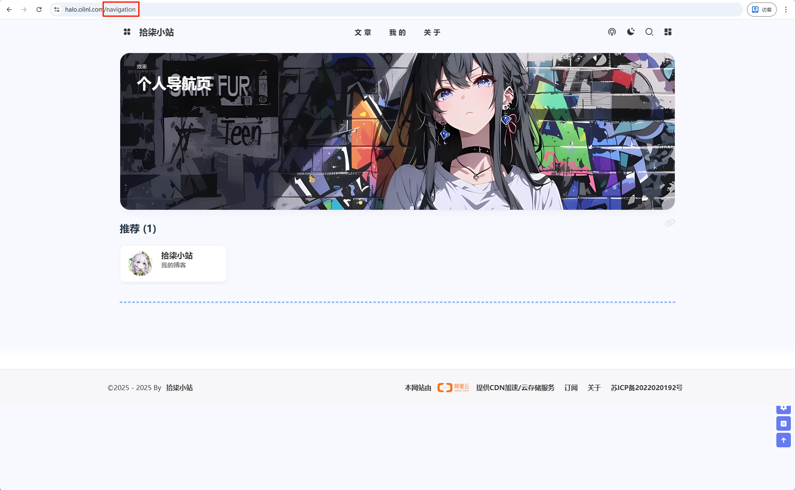
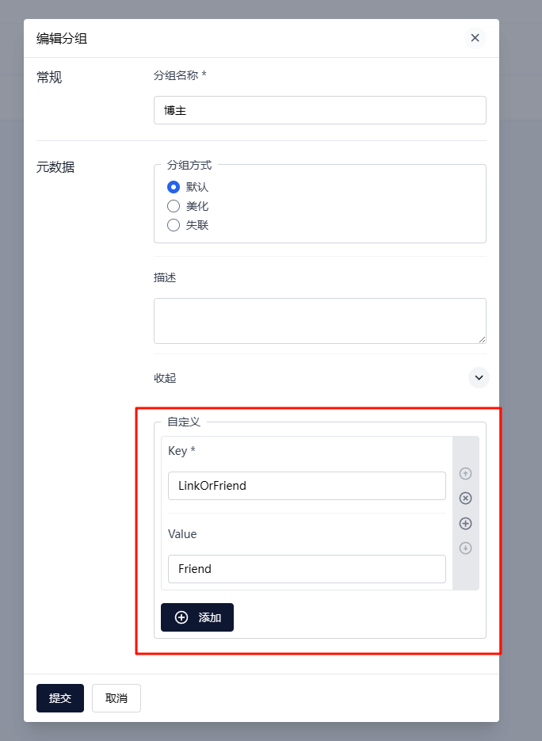

> 本教程是修改的主题是[Halo-theme-Hao](https://github.com/chengzhongxue/halo-theme-hao) 版本是：1.6.6
> 
> 根据友联页面修改而来。
> 
> 原理是添加链接，给分组添加一个自定义属性，通过属性过滤展示的链接

~~效果如图：[前往：导航页](#)~~



下面就开始教程吧！

# 修改Halo运行配置

在运行时会缓存模板文件，下次访问不再会读取物理的模板文件，这会有性能的损耗。

如果我们修改主题，可以添加一个运行参数

[搭建开发环境](https://docs.halo.run/developer-guide/theme/prepare#搭建开发环境)

```shell
# 关闭主题模板缓存
- --spring.thymeleaf.cache=false
```


# 创建navigation模板页面

首先先找到主题文件夹：在持久化存储的`halo2`文件夹下的`themes/theme-hao`里面

## 修改theme.yaml配置

找到`spec.customTemplates.page`添加一个导航页面模板：

```yaml
spec:
  displayName: Hao
  author:
    name: 程序员小航 & 困困鱼 & Carol
    website: https://github.com/chengzhongxue
  customTemplates:
    page:
      - name: 友情链接页面模版
        description: 支持可预设文本的友链
        screenshot:
        file: page_links.html
      # 添加导航页面模板
      - name: 导航页面模板
        description: 个人导航页
        screenshot:
        file: navigation.html
```

## 添加navigation.html

在`templates`目录下新建一个文件`navigation.html`

添加如下内容：

```html
<!DOCTYPE html>
<html  xmlns:th="http://www.thymeleaf.org"
      th:replace="~{modules/layouts/layout :: layout(content = ~{::content}, htmlType = 'page',title = ${singlePage.spec.title + ' | ' + site.title}, head = ~{::head})}">
<th:block th:fragment="head">
    <th:block th:replace="~{modules/common/open-graph :: open-graph(_title = ${singlePage.spec.title},
                _permalink = ${singlePage.status.permalink},
                _cover = ${singlePage.spec.cover},
                _excerpt = ${singlePage.status.excerpt},
                _type = 'website')}"></th:block>
</th:block>
<th:block th:fragment="content">

    <div class="page" id="body-wrap">
        <header class="not-top-img" id="page-header">
            <nav th:replace="~{modules/nav :: nav(title = ${singlePage.spec.title})}"></nav>
            <link rel="stylesheet" type="text/css" th:href="${assets_link + '/libs/fcircle/heo-fcircle3.css'}">

        </header>
        <main class="layout hide-aside" id="content-inner">
            <div id="page">
                <th:block th:replace="~{macro/content-nav :: content-nav(${htmlType})}" />
                <hr/>
                <!--/* 评论组件 */-->
                <th:block
                        th:replace="~{modules/comment :: comment(group = 'content.halo.run',
                  kind = 'SinglePage',
                  name = ${singlePage.metadata.name},
                  allowComment = ${singlePage.spec.allowComment})}"/>
            </div>
        </main>
        <!-- 底部 -->
        <footer th:replace="~{modules/footer}"/>
    </div>

</th:block>

</html>
```

---

如果想要知道如何修改的，看下面：

将友联对应的html文件复制过来，修改`th:block th:replace`标签里面的`content-links` 改为`content-nav`

```html
<th:block th:replace="~{macro/content-links :: content-links(${htmlType})}" />
改为
 <th:block th:replace="~{macro/content-nav :: content-nav(${htmlType})}" />
```

## 创建conten-nav.html

在主题的`templates/macro`文件夹的下创建`conten-nav.html`文件

```html
<th:block th:fragment="content-nav(htmlType)">

    <th:block th:with="groups = ${linkFinder.groupBy()}">
        <div th:replace="~{macro/author-content :: author-content(background = ${theme.config.moment.backgroundImg},
                        smallTitle = '效率',
                        bigTitle = '个人导航页',
                        detail = '',
                        buttonUrl = '',
                        buttonTitle = '')}"></div>

        <!--互动友链-->

        <div class="flink" id="article-container">

            <th:block th:each="group,iterStat : ${groups}">
                <!-- 只显示 LinkOrFriend 注解等于 "Link" 的分组 -->
                <th:block th:if="${!group.metadata.annotations.containsKey('LinkOrFriend')
                  or #strings.isEmpty(group.metadata.annotations['LinkOrFriend'])
                  or #strings.equals(group.metadata.annotations['LinkOrFriend'], 'Link')}">
                <h2 th:if="${not #lists.isEmpty(group.spec.displayName)}">
                    <a class="headerlink" th:href="'#'+${group.spec.displayName}+'-'+${group.links.size}"
                       th:title="${group.spec.displayName}+ '('+${group.links.size}+')'"></a>
                    [[${group.spec.displayName}]] ([[${group.links.size}]])
                </h2>

                <div class="flink-desc" th:if="${not #strings.isEmpty(#annotations.get(group, 'description'))}">[[${#annotations.get(group, 'description')}]]</div>

                <!-- 第一个，使用卡片展示 -->
                <div th:if="${#strings.equals(#annotations.get(group, 'displayStyle'),'beautify') && not #lists.isEmpty(group.links)}"
                     class="site-card-group">

                    <div class="site-card" th:each="link : ${group.links}">
                        <span th:if="${not #strings.isEmpty(#annotations.get(link, 'label'))}"
                              th:style="'background-color:' + ${#annotations.get(link,'labelColor')}"
                              class="site-card-tag">[[${#annotations.get(link, 'label')}]]</span>

                        <a class="img" target="_blank" th:href="${link.spec.url}" th:title="${link.spec.displayName}">
                            
                        </a>

                        <a class="info cf-friends-link" target="_blank" th:href="${link.spec.url}"
                           th:title="${link.spec.displayName}">
                            <div class="site-card-avatar no-lightbox">
                                
                            </div>
                            <div class="site-card-text">
                                <span class="title cf-friends-name" th:text="${link.spec.displayName}"></span>
                                <span class="desc" th:text="${link.spec.description}"
                                      th:title="${link.spec.description}"></span>
                            </div>
                        </a>
                    </div>


                </div>

                <div class="flink-list"
                     th:if="${#strings.equals(#annotations.get(group, 'displayStyle'),'default') && not #lists.isEmpty(group.links)}">
                    <div class="flink-list-item" th:each="link : ${group.links}">
                        <span th:if="${not #strings.isEmpty(#annotations.get(link, 'label'))}"
                              th:style="'background-color:' + ${#annotations.get(link,'labelColor')}"
                              class="site-card-tag">[[${#annotations.get(link, 'label')}]]</span>
                        <a class="cf-friends-link" rel="external nofollow" target="_blank" th:href="${link.spec.url}"
                           th:title="${link.spec.displayName}">
                            
                            <div class="flink-item-info no-lightbox">
                                <span class="flink-item-name cf-friends-name" th:text="${link.spec.displayName}"></span>
                                <span class="flink-item-desc" th:text="${link.spec.description}"
                                      th:title="${link.spec.description}"></span>
                                
                            </div>
                        </a>
                    </div>
                </div>

                <div class="flink-list mini"
                     th:if="${#strings.equals(#annotations.get(group, 'displayStyle'),'deprecated') && not #lists.isEmpty(group.links)}">
                    <div class="flink-list-item" th:each="link : ${group.links}">
                        <a class="cf-friends-link" rel="external nofollow" target="_blank" th:href="${link.spec.url}"
                           th:title="${link.spec.displayName}">
                            
                            <div class="img-alt is-center">[[${link.spec.displayName}]]</div>
                            <div class="flink-item-info">
                                <span class="flink-item-name cf-friends-name">[[${link.spec.displayName}]]</span>
                                <span class="flink-item-desc"
                                      th:title="${link.spec.description}">[[${link.spec.description}]]</span>
                            </div>
                        </a>
                    </div>
                </div>
                </th:block>
            </th:block>

            <th:block th:if="${not #strings.isEmpty(theme.config.link.linksArticle)}"
                      th:utext="${theme.config.link.linksArticle}"> </th:block>

            <script>
                var fdataUser = {
                    jsonurl: '',
                    apiurl: "[(${theme.config.fcircle.apiurl})]",
                    apipublicurl: '', //默认公共库
                    initnumber: 20,  //首次加载文章数
                    stepnumber: 20,  //更多加载文章数
                    article_sort: 'created', //文章排序 updated or created
                    error_img: 'https://sdn.geekzu.org/avatar/57d8260dfb55501c37dde588e7c3852c'
                }
            </script>
            <script  th:src="@{/assets/libs/fcircle/heo-fcircle3mini.js}"></script>

            <th:block th:if="${htmlType == 'page'}" th:utext="${singlePage.content.content}">
            </th:block>

        </div>

    </th:block>
</th:block>

```

该组件是从友联页面拷贝而来，上面图片使用的是moments.html里面的。如需修改请自行修改

其中：

```html
<th:block th:if="${!group.metadata.annotations.containsKey('LinkOrFriend')
                  or #strings.isEmpty(group.metadata.annotations['LinkOrFriend'])
                  or #strings.equals(group.metadata.annotations['LinkOrFriend'], 'Link')}">
    
  <!-- 是只显示 LinkOrFriend 注解等于 "Link" 的分组 -->
```

## 修改links

要让友联页面只显示友联的链接。

## 修改content-links.html

这个页面为展示的链接

找到`macro\content-links.html`，大概28行有一个`<th:block th:each="group : ${groups}">`修改为以下：

```html
<th:block th:each="group : ${groups}"
                              th:if="${group.metadata != null
                                 and group.metadata.annotations != null
                                 and #strings.equals(group.metadata.annotations['LinkOrFriend'], 'Friend')}">
```

## 修改links-canvas.html

这个页面为展示的互动canvas

到最底下修改JavaScript脚本：

```html
 <script th:inline="javascript">
        function refreshFrame() {
            document.getElementById('iframe').contentWindow.location.reload(true);
        }
        const group = [[${ groups }]]

        // 只保留：LinkOrFrend 有值 且 等于 'Frend'
        const filteredGroups = groups.filter(group => {
            const value = group?.metadata?.annotations?.['LinkOrFriend'];
            return value !== undefined && value !== null && value === 'Friend';
        });

        const logos = filteredGroups
            .flatMap(group => group.links || [])
            .map(link => link.spec?.logo)
            .filter(logo => logo && typeof logo === 'string' && logo.trim() !== '');

        localStorage.setItem('logos', JSON.stringify(logos))
    </script>
```

## 创建页面

在后台创建一个页面，自定义模板选择我们刚才创建的`导航页面模板`，进行发布。

## 创建链接

随后在后台的`链接`里面添加分组自定义一个参数`LinkOrFriend=Friend`就在友联里面显示，`LinkOrFriend=Link`或者不填写，就在导航页里面显示


