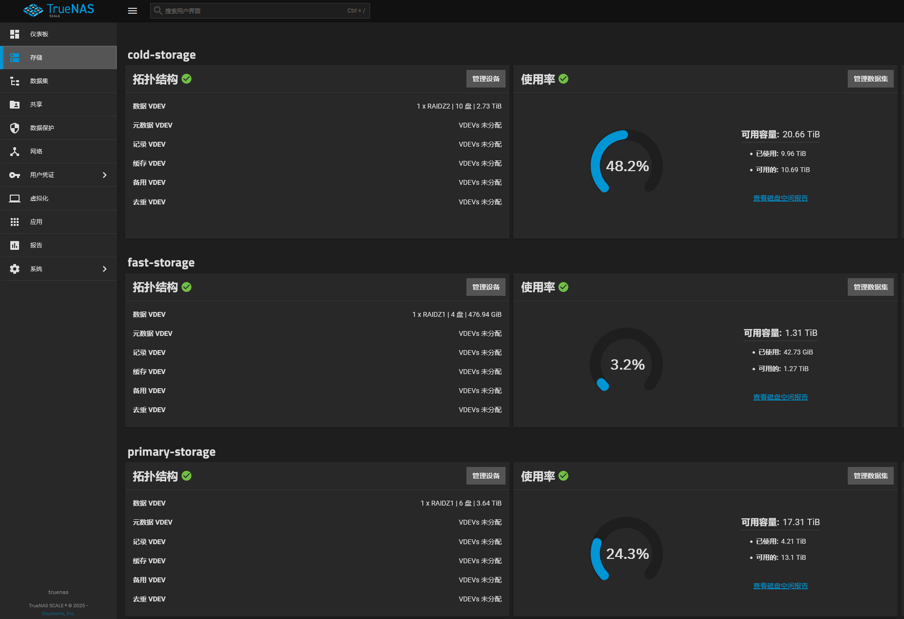

# 什么是Homelab

Homelab 是指可在家中搭建的实验（折腾）环境，用于进行实验和学习。通常指一系列硬件设备（家用服务器、小主机、旧电脑手机、树莓派等），上面运行着操作系统环境和软件（Linux、虚拟机、Docker
等）。Homelab 有很多种用途，比如作为软路由、远程主机，也可以部署一系列的自托管服务，如个人书库、影视库、密码管理器、个人网站、RSS
阅读器、播客服务器、备忘录等等。不仅实用，也可以作一门兴趣，为生活增添乐趣。

# 我的 Homelab 配置

我自己的 Homelab 配置是 轻量云服务器 + 小主机 + NAS，它们的配置与用途各有千秋：

|      | 云服务器（阿里云2H2G） | 小主机（联想Tiny5 M920X） | NAS(自组TrueNAS) |
|------|---------------|--------------------|----------------|
| 公网IP | 稳定（有静态公网IP）   | 不稳定（有动态公网IP）       | 不稳定（有动态公网IP）   |
| 存储空间 | 小             | 中                  | 大              |
| 性能   | 低             | 高                  | 低              |

不难看出，这三种都是偏科生，但是只要合作起来就是三边形战士，**云服务器**偏向网络访问型，**小主机**偏向性能处理行，**NAS**
偏向空间存储型。

## 云服务器

通常就是云厂商提供的服务器，我们只需要一个稳定的公网ip，作为网络访问的入口，通常无需太高的配置，只需要运行端口转发、异地组网类的组件即可，这里可以选用轻量云服务器，通常做完活动也就100不到/年（也可以去闲🐟淘那种一年50块钱的，他们会给你开一个ARM账号，登录进去就可以用了）

因为有公网IP（80/443），所以我在这台云服务器上面部署的服务，主要是Frp服务，反向代理等需要通过公网直接访问的服务。

当然，可以通过Frp服务将家里的服务映射到这台服务器的指定端口，然后通过反向代理直接使用域名访问。

## 小主机

这里使用的是联想1U小主机，Tiny5 M920X，这机器最让我满意的地方就是小。网上有专门的3D打印套件，能让两台这样的小家伙正好塞进机柜的1U空间里，排得整整齐齐，对我这种有点整理癖的人来说，看着就非常舒服。

配置上我没追求极致，讲究个够用和稳妥。CPU是i5-9500T，省电性能也足够；内存给到了32G
DDR4，确保多开服务不卡；硬盘方面，系统单独跑在一块128G的闪迪SATA固态上，数据盘则是两块致钛1T
NVMe固态，用飞牛系统里的ZFS组了RAID1，这样既保证了速度，又允许坏一块盘数据也不丢，图个安心。为了突破千兆内网的瓶颈，我还给它插了一张迈络思的X3万兆光口网卡。

之所以选择飞牛系统，主要是因为它现在越来越完善，省心。一来，它自带的ZFS功能满足了我对数据安全的基本要求。二来，它的相册和影视应用直接解决了我的两大痛点：之前用的Immich在iOS上太卡，飞牛相册备份体验很流畅；飞牛影视则让我能轻松管理并播放自己的电影库。说白了，就是一套系统把我想要的功能都整齐活了。

## NAS

NAS我是自己组装了一台TrueNas主机，主板是华硕的PRIME Z370M-Plue II，CPU使用的是i3-8100T，内存32G DDR4。
这里使用了2U的工控机箱，使用了2个浪潮5212M4定制硬盘笼，使用了2张阵列卡分别连接2个硬盘笼子，至于供电是使用的服务器电源+同步器的方案。

目前放了6x4T HDD、10x3T HDD、4x512 SSD

这里的规划是这样的

| 存储池             | 类型  | 用途   |
|-----------------|-----|------|
| cold-storage    | HDD | 冷备份  |
| primary-storage | HDD | 常用数据 |
| fast-storage    | SSD | 核心推荐 |

